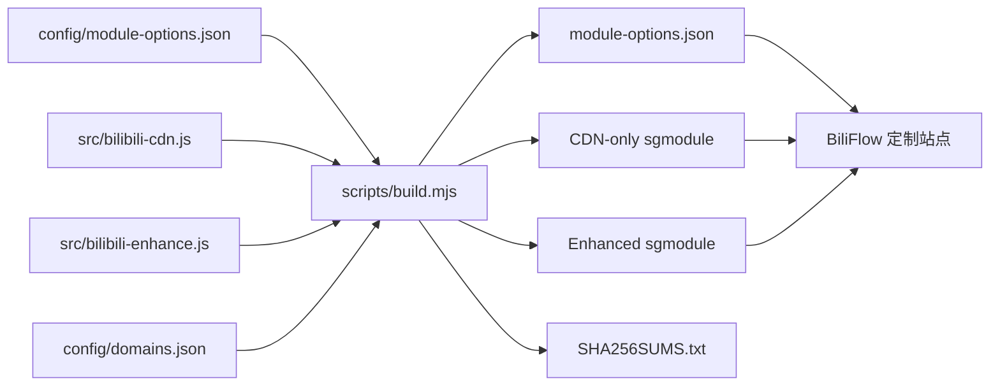

# v3 架构、数据流与安全边界

> 适用版本：`3.0.0`
>
> 本文描述仓库当前实现，不代表所有 Bilibili App/iOS 组合已完成真机验证。

## 设计目标

v3 把同一套经过审核的配置生成成两个独立 Shadowrocket 模块，并由一个
iPhone/iPad 优先的网站生成可持续更新的定制 URL：

| 产物 | 路由与 CDN | 广告过滤 | 推荐仅普通视频 | 界面逐项精简 |
| --- | --- | --- | --- | --- |
| `Bilibili.CDN.Switcher.sgmodule` | 是 | 否 | 否 | 否 |
| `Bilibili.CDN.Enhanced.sgmodule` | 是 | 是 | 是 | 是 |
| `Bilibili.CDN.sgmodule` | 是 | 是 | 是 | 是，Enhanced 的历史兼容别名 |

实现优先保证播放正确、更新可回滚和失败时保留原始响应。它不以最低延迟为唯一
目标，也不修改账号、会员、支付、订单、已购权益、地区授权或服务端鉴权结果。

## 单一配置源与构建流程

`config/module-options.json` 是模块参数与网站选项的单一配置源。
`scripts/build.mjs` 在生成前同时校验：

- 分组、键名、中文参数名、类型、默认值、数值范围和适用变体；
- 每个参数与运行脚本默认值是否一致；
- 固定 CDN 候选配置与运行脚本是否一致；
- 远程资源是否为 HTTPS；
- 两个变体是否只包含各自应有的脚本和 MITM 主机。

`npm run build:check` 在内存中重新生成全部产物并与 `dist/` 逐字节比较，防止手工
修改生成文件或源文件与发行资产漂移。

## Shadowrocket 运行时数据流

### 1. 分流

`[Rule]` 覆盖 Bilibili 主站、API、静态资源、点播 CDN 和直播 CDN。所有规则使用
用户提供的 `分流策略`，只有窄 PCDN 域
`*pcdn*.biliapi.net` 可以单独使用 `PCDN策略`。

国内和海外均应把 Shadowrocket“全局路由”设为“配置”。海外用户如需大陆线路，
应把准确的回国策略组名称填入模块参数；普通海外代理不等同于大陆回国线路。

### 2. 播放地址处理

`src/bilibili-cdn.js` 只处理模块明确列出的播放地址 JSON/gRPC API，不匹配或读取
媒体分片响应体。直播签名 URL 始终保留服务端 host/path/query。

`CDN=auto` 的候选仅来自**同一个媒体对象本次响应中的完整主 URL 与备用 URL**：

1. 用资源路径、媒体类型、清晰度/表示元数据、编码、带宽、候选集合和网络档案
   生成不含签名 query 的固定长度摘要；
2. 只在相同普通 CDN、MCDN 或 PCDN 家族内比较；
3. 每次响应最多选择一个媒体对象，同时验证主路线和一个备用路线；
4. 使用 `GET` 与 `Range: bytes=0-16383`，只接受与请求 URL 一致、没有重定向、
   没有内容编码、状态为 `206` 且长度合理的媒体响应；
5. 备用路线需至少间隔 10 分钟成功两次，并达到 `切换阈值`；
6. 学习请求本身不改写，只有后续重新获取的播放地址可以使用已确认选择；
7. 晋升备用 URL 后保留原始主 URL 作为备用，不复用过期签名；
8. 全局探测至少间隔 2 分钟；单资源有锁、失败退避和探索间隔；
9. 状态最多 64 项；只保存摘要、候选 ID、计数和时间戳。

存储、HTTP、解析、超时或持久化任一环节异常时，脚本返回原始响应。

### 3. Enhanced 响应过滤

`src/bilibili-enhance.js` 使用精确主机与路径分类，不对任意 JSON 递归搜索并删除
疑似广告。处理原则：

- JSON 通常只删除明确广告字段、已审核类型或同时命中多项商业特征的对象；
- 播放页推荐是明确例外：`推荐仅普通视频=true` 时采用普通 AV 白名单，无法确认
  为普通视频的推荐卡删除；
- 首页和“我的”只从服务端原始数组中删除明确目标，不用静态白名单重建数组；
- 播放页推荐以外的未知卡片，以及所有未知字段、登录、消息、未读数、真实会员
  状态和权益原样保留；
- gRPC 只处理列出的精确方法和字段号；未知 wire bytes 原样复制；
- 压缩帧、损坏消息、超大响应和未知方法全部原样返回；
- `广告过滤=false` 时 gRPC 广告处理也完全停用；
- `推荐仅普通视频` 是 `广告过滤` 下的细分开关；关闭广告过滤时推荐响应不改写；
- `界面精简=false` 时保留各逐项选择，但不执行首页/“我的”入口删除。

普通视频白名单在 JSON、View v1 和 ViewUnite 三条路径一致执行。View v1 仅保留
`goto(7) == "av"`；ViewUnite 仅保留关系卡类型 `1 (AV)`，并继续拒绝带
`cm_stock` 或 `BasicInfo.unique_id` 的伪装推广卡。介绍模块类型 `18`（活动横幅）、
`29`（大会员横幅）和 `55`（UP 主商品分享）仍按已审核语义处理；类型 `29` 还受
`会员营销` 开关控制。详细字段与失败边界见
[Protobuf/gRPC 兼容性记录](PROTOBUF_COMPATIBILITY.md)。

## HTTPS 解密边界

MITM 只包含需要读取播放地址或过滤内容的 Bilibili API 主机。点播和直播媒体
CDN 不在 MITM 列表中。CDN-only 不包含 Enhanced 的直播 JSON 处理主机。

未安装并完全信任 Shadowrocket CA 时，分流规则仍可工作，但所有响应脚本都不会
获得可处理的明文响应。证书只应保留在用户自己的设备上。

## BiliFlow 网站

网站的三个主要入口为：

- `/`：SSR 页面和客户端定制界面；
- `/api/catalog`：读取并验证 `main/dist/module-options.json`；
- `/module.sgmodule`：读取最新模块，替换 `#!arguments` 后返回。

网页可以在 GitHub 暂时不可用时使用打包目录继续展示，但**模块生成不使用降级
目录**。生成接口必须同时取得并验证 `main` 的最新目录和对应模块，否则返回
`502`，避免旧目录与新脚本漂移。

生成接口的信任边界：

- 仓库和两个模块路径固定，客户端不能提供第三方脚本 URL；
- 禁止未知、重复和不适用于当前变体的参数；
- 布尔值、数值范围、策略名、网络档案和固定 CDN 主机分别校验；
- 禁止逗号、冒号、花括号、换行等可改变模块结构的字符；
- 模块大小、头部、版本、`[Script]`、`[MITM]` 和变体结构必须有效；
- `#!arguments` 的名称、顺序和全部 `{{{placeholder}}}` 必须与最新目录精确一致；
- 定制响应使用 `no-store`，错误响应使用 JSON，不会把未验证模板下发给
  Shadowrocket。

浏览器只在本地 `localStorage` 保存用户选择。项目没有账号、数据库、分析脚本、
广告 SDK 或用户数据上报。

## 更新与兼容

推荐安装 `main/dist/*.sgmodule` 的固定 URL。Shadowrocket 更新同一地址时会取得
最新模块；BiliFlow 生成的 URL 把选择编码在查询参数中，因此更新时会重新读取
最新目录/模块并保留这些选择。

兼容策略：

- `Bilibili.CDN.sgmodule` 始终与 Enhanced 产物逐字节一致；
- 新参数只在中央目录中增加，并由构建、网站和 CI 同时校验；
- 旧 URL 不改名；发行版另提供带 SHA-256 的归档资产；
- 未知未来服务入口默认显示；未知未来 Protobuf 字段默认保留。播放页关系卡的
  未知类型在 `推荐仅普通视频=true` 时删除，这是该开关的预期失败关闭行为。

## 失败模式与回滚

| 故障 | 默认行为 | 最小回滚 |
| --- | --- | --- |
| 播放地址无法解析或探测失败 | 原始响应放行 | `CDN=off` |
| CDN/PCDN 策略导致播放异常 | 不改账号或内容数据 | PCDN 改为与分流相同 |
| 广告/UI 端点变更 | 通常保留；播放页未知推荐类型按白名单删除 | 关闭对应总开关或逐项开关 |
| gRPC 压缩、损坏或超限 | 整份响应原样返回 | 关闭 `广告过滤` |
| GitHub 目录或模块不可用 | 网站生成返回 `502` | 使用已安装模块或发行版 |
| 与其他 Bilibili 模块冲突 | 不尝试覆盖其结果 | 暂停其他模块后逐个启用 |

最终恢复手段是停用本模块；这会让 Bilibili 回到原始网络行为。

## 验证层级

1. `npm run check`：确定性生成、核心 JSON/gRPC、双模块和安全自动 CDN 单元测试。
2. `npm run check:site`：站点 lint、生产构建、SSR、固定源、双变体、注入拒绝和
   漂移/中断失败关闭测试。
3. `npm run check:all`：CI 与发布工作流使用的完整离线门禁。
4. `npm run smoke:auto`：可选联网冒烟；不作为合并门禁。
5. [真机验收清单](DEVICE_ACCEPTANCE.md)：iPhone/iPad、iOS、Shadowrocket、
   Bilibili App、账号与网络组合的最终人工确认。
