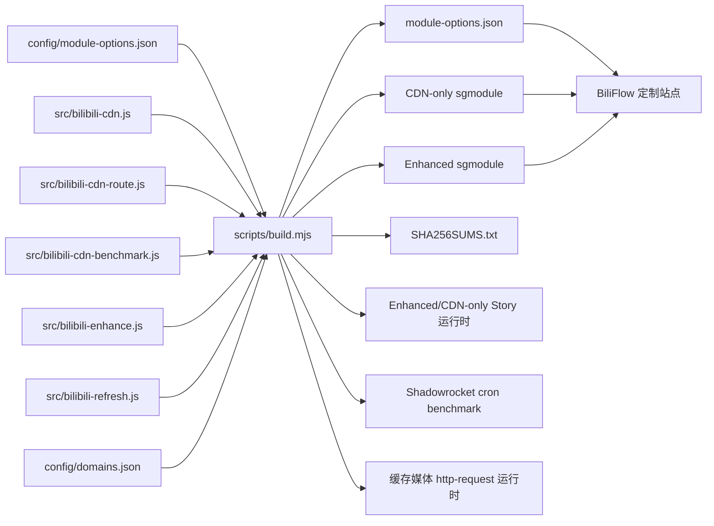

# v3 架构、数据流与安全边界

> 适用版本：`3.8.1`
>
> 本文描述仓库当前实现，不代表所有 Bilibili App/iOS 组合已完成真机验证。
> 当前专项入口以 Bilibili iOS 9.5.0 请求构建号 `90500100` 为验收基线。

## 设计目标

v3 把同一套经过审核的配置生成成两个独立 Shadowrocket 模块，并由一个
iPhone/iPad 优先的网站生成可持续更新的定制 URL：

| 产物 | 路由与 CDN | 广告过滤 | 首页 6 条 AV | 播放页仅普通视频 | 界面逐项精简 |
| --- | --- | --- | --- | --- | --- |
| `Bilibili.CDN.Switcher.sgmodule` | 是 | 否 | 否 | 否 | 否 |
| `Bilibili.CDN.Enhanced.sgmodule` | 是 | 是 | 是 | 是 | 是 |
| `Bilibili.CDN.sgmodule` | 是 | 是 | 是 | 是 | 是，Enhanced 的历史兼容别名 |

实现优先保证播放正确、更新可回滚和失败时保留原始响应。它不以最低延迟为唯一
目标，也不修改账号、会员、支付、订单、已购权益、地区授权或服务端鉴权结果。

## 单一配置源与构建流程

`config/module-options.json` 是模块参数与网站选项的单一配置源。
`scripts/build.mjs` 在生成前同时校验：

- 分组、键名、中文参数名、类型、默认值、数值范围和适用变体；
- 每个参数与运行脚本默认值是否一致；
- 固定 CDN 候选配置与运行脚本是否一致；
- 远程资源是否为 HTTPS；
- 两个变体是否只包含各自应有的脚本和 MITM 主机。

`npm run build:check` 在内存中重新生成全部产物并与 `dist/` 逐字节比较，防止手工
修改生成文件或源文件与发行资产漂移。

## Shadowrocket 运行时数据流

### 1. 分流

`[Rule]` 覆盖 Bilibili 主站、API、静态资源、点播 CDN 和直播 CDN。所有规则使用
用户提供的 `分流策略`，只有窄 PCDN 域
`*pcdn*.biliapi.net` 可以单独使用 `PCDN策略`。

国内和海外均应把 Shadowrocket“全局路由”设为“配置”。海外用户如需大陆线路，
应把准确的回国策略组名称填入模块参数；普通海外代理不等同于大陆回国线路。

### 2. 播放地址处理

`src/bilibili-cdn.js` 只处理模块明确列出的播放地址 JSON/gRPC API，不匹配或读取
媒体分片响应体。直播签名 URL 始终保留服务端 host/path/query。

默认 `CDN=auto, probeMode=cron` 分为两个互不等待的阶段：

1. `bilibili-cdn-benchmark.js` 由六字段 cron 每两小时唤醒，按参数中的 2–72 小时
   间隔决定是否运行；它只使用轮换的公共未登录 BVID，不读取用户 Cookie、
   `access_key`、设备标识或日志 URL；
2. cron 优先选服务端完整 Akamai 作为参考，先取 64 KiB 前缀总长，再在 1/4、
   1/2、3/4 附近轮换同一个 1 MiB 内部 Range；参考、当前胜者、待二次对象确认的
   主机和一个轮换挑战者串行测试，每请求硬截止 5 秒；
3. 所有候选必须与参考的 `206`、Range、总长、实际长度、内容 hash 和内容类型
   一致，且无压缩、跨对象重定向或 HTML/JSON 错误体；
4. v8 每网络档案最多 16 主机，每主机 8 个样本、4 个对象 hash。主机至少通过两个
   不同对象，最近 6 小时成功，失败率不高于 25%，未熔断，且 p25 吞吐达到
   `max(10 Mbps, 表示所需吞吐 × 1.8)` 才合格；
5. 稳定分数以 p25 吞吐为主，失败率与 MAD/中位抖动比作为惩罚。连续两次失败或
   最近四次中两次失败会熔断两小时；一次失败不清空最后胜者；
6. JSON、gRPC 与 Story 播放响应只同步读 `BiliCDN.hostAuto.v8`，不发 probe、
   不等待 cron 锁；选出当前响应的完整目标 URL 后，会在 `$done()` 前同步更新有界
   `BiliCDN.mediaRoutes.v9`；
7. 新鲜合格的完整服务端候选直接重排。经两个对象验证的维护列表非 Akamai alias
   可以从当前主 URL复制并只替换 hostname；scheme、port、path 和 query 保留；
8. Akamai 从不做 hostname 拼接。没有合格状态时，只在本次响应带完整签名 Akamai
   URL 时立即提升它，并把原主 URL 放在备选首位；否则保留服务器主 URL；
9. alias 6 小时后失效，状态超过 24 小时只执行冷启动回退；最多 4 个显式网络
   档案。v8 持久化只保存主机名、对象 hash、统计和时间戳，不保存 path、query、
   token、完整 URL 或正文；
10. v7 exact-object 状态不迁移。旧 `nonblocking` 输入归一化为 `cron`；显式
    `blocking` 保留旧 v7 同对象诊断路径，`off` 停止 cron 但仍允许完整 Akamai
    冷启动回退。

状态损坏、过期或持久化不可用时仍能执行完整 Akamai 冷启动规则；响应无法解析时
原样放行。

v9 是独立的短期精确路由表，用于 App 在新播放响应处理完成前已经复用缓存/预加载
地址的情况。每条记录保存当前响应实际选中的完整服务端 URL，按 query-free path、
`deadline/exp`、`trid`、`mid`、`oi`、`buvid`、网络档案和表示档案绑定；最多 64 条，
在签名到期前至少 30 秒或最长 2 小时清除。`src/bilibili-cdn-route.js` 只处理点播
`/upgcxcode/` GET/HEAD，请求命中完整绑定后逐字节替换 URL，并保留 Range、
User-Agent 和其他请求头。它不发网络探测、不合成签名、不处理直播，也不要求媒体
CDN MITM。任一校验失败都原地址放行。

JSON 和 gRPC 入口都优先使用 Shadowrocket 提供的二进制正文；受支持的 gzip
gRPC 消息在 4 MiB 上限内逐帧解压，修改后封装为标准未压缩消息。固定主机模式
只接受已审核媒体域，并且只提升当前媒体对象已经返回的完整目标-host URL；目标
host 不在当前候选或任一 alias lane 不匹配时原样放行，不执行 host 拼接。

### 3. Enhanced 响应过滤

`src/bilibili-enhance.js` 使用精确主机与路径分类，不对任意 JSON 递归搜索并删除
疑似广告。处理原则：

- JSON 通常只删除明确广告字段、已审核类型或同时命中多项商业特征的对象；
- 首页/推荐流是明确例外：`首页推荐6个普通视频=true` 时，普通视频必须同时
  携带 AV/video 类型与具体视频身份；每次响应按服务端原顺序最多保留前 6 个；
- 播放页推荐是明确例外：`推荐仅普通视频=true` 时采用普通 AV 白名单，无法确认
  为普通视频的推荐卡删除；
- Story、`/story/cart` 与 `/relate/story` 由一个生成运行时依次执行过滤和 CDN 处理，避免两个
  响应脚本分别写回；Story 严格模式还要求真实视频身份和非负可用状态；
- JSON 搜索与 gRPC `SearchAll`/`SearchByType` 仅删除已验证商业 oneof、商业
  角标或商业 URI，未知搜索 schema 原样保留；
- 首页导航和“我的”只从服务端原始数组中删除明确目标，不用静态白名单重建数组；
- 两个严格推荐流以外的未知卡片，以及所有未知字段、登录、消息、未读数、真实
  会员状态和权益原样保留；
- gRPC 只处理列出的精确方法和字段号；未知 wire bytes 原样复制；
- Shadowrocket gRPC 入口优先读取 `bodyBytes`；gzip 帧在 WebView 的
  `DecompressionStream` 中按 4 MiB 上限解压，修改后输出标准未压缩帧；
- 未知压缩格式、解压能力不可用、损坏消息、超大响应和未知方法全部原样返回；
- `广告过滤=false` 时 gRPC 广告处理也完全停用；
- `首页推荐6个普通视频` 是 `广告过滤` 下的细分开关；关闭后首页恢复保守的
  明确广告过滤，不再执行普通视频白名单或六条上限；
- `推荐仅普通视频` 是 `广告过滤` 下的细分开关；关闭广告过滤时推荐响应不改写；
- `界面精简=false` 时保留各逐项选择，但不执行首页/“我的”入口删除。

播放过程会再次请求旧版与新版 `ViewProgress`。Enhanced 只进入
`video_guide(1)`，并删除活动类型或有明确商业证据的 Material；对新版
`dm(4)` 只删除 `OperationCard(3)` 中预约活动、跳转和预约游戏业务，普通 command
DM、AttentionCard、关注视频/追番卡及未知字段均保留。9.4.0/9.5.0 的
`View/PlayPause` 只删除含明确商业
URL/creative/广告字段证据的 length-delimited 字段，
`View/ViewEndPage` 只过滤已验证 `ViewEndPageCard.relate(1)` 中的广告或
非普通 AV 关系卡。Chronos、视频快照、进度点、播放地址、普通 AV、未知顶层
wire bytes 和无商业证据的暂停字段不在删除目标中。未知 schema 原样放行。
“我的”页另对明确的 `vip_section`、`vip_section_v2`、
`modular_vip_section` 容器及 `/x/vip/ads/materials` 专用响应做独立处理，
但不修改 `vip` 会员状态对象。后台恢复时异步返回的
`bilibili.app.mine.v1.Mine/PubModule` 只移除 `PubGuide`，保留 UGC、动态及
未知卡。

首页 App JSON 白名单还要求当前已审核普通 AV 卡型，App/Web 都要求明确
AV/video 类型和视频身份，拒绝横幅、CM、
游戏/应用、PGC/OGV、纪录片、影视、综艺、直播、活动、未知与商业伪装卡；Story
严格模式只保留 `vertical_av`。App 首页不足六条时最多使用原始完整请求 URL
补取一次，补取结果重新过滤并按视频身份去重，不合成或跨历史响应补位，也不修改
刷新计时；带内部补取标记的请求不会再次补取，因此不会形成重入循环。
`bilibili.app.show.v1.Popular/Index` 备用流执行相同边界：只接受
标准小/大封面 AV oneof、明确 `av/video` 类型且带视频身份的卡，最多保留 6 条。

`src/bilibili-refresh.js` 只在四个 splash、Home/Story/Relate Story、View、
Mine/Mine-iPad/myinfo 与 VIP materials/material-report 易变请求上移除 ETag/
时间条件校验头，并设置 `no-cache, no-store`。它不改 URL、查询参数、正文或
签名；目标是让冷/热启动、刷新和后台恢复后的新服务端响应再次进入过滤链，而
不是依赖可能绕过响应脚本的 304/旧缓存。实际过滤的易变响应还会移除缓存元数据并
返回 no-store；`myinfo` 和资源 `Module/List` 继续不改响应头。

`/x/v2/account/myinfo`、`Mine/DeviceFeature` 与
`bilibili.app.resource.v1.Module/List` 当前只做结构诊断并逐字节透传：
`DeviceFeatureResp.actionData(1)` 会执行严格 UTF-8/JSON 验证，但在没有脱敏
fixture 证明具体 action 安全之前不会修改；`Module/List` 不阻断资源模块更新。

专用广告素材接口使用与其协议匹配的空安全响应，包括资源顶部/补丁活动、
PGC 活动物料、直播购物信息和 Biligame 直播大卡素材；精确主机和路径以外的请求
不匹配。

播放页普通视频白名单在 JSON、View v1 和 ViewUnite 三条路径一致执行。JSON 需要
明确普通视频类型或 `/video/` 地址，单独 AVID/BVID 不作为类型证据；View v1
仅保留 `goto(7) == "av"`；ViewUnite 同时要求关系卡类型 `1 (AV)` 和 oneof
`av(2)`，并继续拒绝带 `cm_stock`、`BasicInfo.unique_id` 或非 AV oneof 的伪装卡。
介绍模块类型 `18`（活动）、`37`（特殊推广标签）、`55`（商品分享）、
`63`（视频提及推广）和 `29`（大会员横幅）按当前审核语义处理；类型 `29` 还受
`会员营销` 开关控制。详细字段与失败边界见
[Protobuf/gRPC 兼容性记录](PROTOBUF_COMPATIBILITY.md)。

## HTTPS 解密边界

MITM 只包含需要读取播放地址或过滤内容的 Bilibili API 主机。点播和直播媒体
CDN 不在 MITM 列表中。CDN-only 不包含 Enhanced 的直播 JSON 处理主机。

未安装并完全信任 Shadowrocket CA 时，分流规则仍可工作，但所有响应脚本都不会
获得可处理的明文响应。证书只应保留在用户自己的设备上。

## BiliFlow 网站

网站的三个主要入口为：

- `/`：SSR 页面和客户端定制界面；
- `/api/catalog`：读取并验证 `main/dist/module-options.json`；
- `/module.sgmodule`：优先读取最新模块，替换 `#!arguments` 后返回。

GitHub 可用时，生成接口读取并验证 `main` 的最新目录与对应模块。Sites
生产网络暂时无法访问 GitHub 时，只回退到与当前站点部署来自同一提交、并在
构建期通过检查的目录和模块快照。无论在线或快照来源，参数名称、顺序与占位符
都必须完全一致；来源混用导致漂移或任一结构校验失败时返回 `502`。

生成接口的信任边界：

- 仓库和两个模块路径固定，客户端不能提供第三方脚本 URL；
- 禁止未知、重复和不适用于当前变体的参数；
- 布尔值、数值范围、策略名、网络档案和固定 CDN 主机分别校验；
- 禁止逗号、冒号、花括号、换行等可改变模块结构的字符；
- 模块大小、头部、版本、`[Script]`、`[MITM]` 和变体结构必须有效；
- `#!arguments` 的名称、顺序和全部 `{{{placeholder}}}` 必须与最新目录精确一致；
- 定制响应使用 `no-store`，错误响应使用 JSON，不会把未验证模板下发给
  Shadowrocket。

浏览器只在本地 `localStorage` 保存用户选择。项目没有账号、数据库、分析脚本、
广告 SDK 或用户数据上报。

## 更新与兼容

推荐安装 `main/dist/*.sgmodule` 的固定 URL。Shadowrocket 更新同一地址时会取得
最新模块；BiliFlow 生成的 URL 把选择编码在查询参数中，因此更新时会重新读取
最新目录/模块并保留这些选择。生成模块内的规则集与脚本 URL 还带语义版本查询键，
模块版本变化时会形成新的 Shadowrocket 远程资源缓存键。

兼容策略：

- `Bilibili.CDN.sgmodule` 始终与 Enhanced 产物逐字节一致；
- 新参数只在中央目录中增加，并由构建、网站和 CI 同时校验；
- 旧 URL 不改名；发行版另提供带 SHA-256 的归档资产；
- 未知未来服务入口默认显示；未知未来 Protobuf 字段默认保留。播放页关系卡的
  未知类型在 `推荐仅普通视频=true` 时删除；首页推荐流未知类型在
  `首页推荐6个普通视频=true` 时删除。这是两个严格开关的预期失败关闭行为。

## 失败模式与回滚

| 故障 | 默认行为 | 最小回滚 |
| --- | --- | --- |
| 播放地址无法解析 | 原始响应放行 | `CDN=off` |
| cron 失败、状态损坏或长期未运行 | 使用服务端完整 Akamai；缺少则保留原主 URL | `测速方式=off` 或 `CDN=off` |
| v9 精确路由缺失、损坏或过期 | 缓存媒体请求原地址放行；下一份新播放响应重新填充 | `CDN=off` |
| CDN/PCDN 策略导致播放异常 | 不改账号或内容数据 | PCDN 改为与分流相同 |
| 广告/UI 端点变更 | 通常保留；首页/播放页未知推荐类型按各自白名单删除 | 关闭对应严格开关、总开关或逐项开关 |
| gRPC gzip 解压、消息解析或大小检查失败 | 整份响应原样返回 | 关闭 `广告过滤` |
| GitHub 目录或模块不可用 | 使用同部署提交的已审核快照；快照不匹配则返回 `502` | 使用已安装模块或发行版 |
| 与其他 Bilibili 模块冲突 | 不尝试覆盖其结果 | 暂停其他模块后逐个启用 |

最终恢复手段是停用本模块；这会让 Bilibili 回到原始网络行为。

## 验证层级

1. `npm run check`：确定性生成、核心 JSON/gRPC、双模块和安全自动 CDN 单元测试。
2. `npm run check:site`：站点 lint、生产构建、SSR、固定源、双变体、注入拒绝和
   漂移/中断失败关闭测试。
3. `npm run check:all`：CI 与发布工作流使用的完整离线门禁。
4. `npm run smoke:auto`：可选联网冒烟；不作为合并门禁。
5. `npm run benchmark:cdn`：可选匿名联网逐主机 Range/hash 基准。
6. [真机验收清单](DEVICE_ACCEPTANCE.md)：iPhone/iPad、iOS、Shadowrocket、
   Bilibili App、账号与网络组合的最终人工确认。
